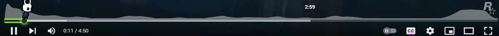
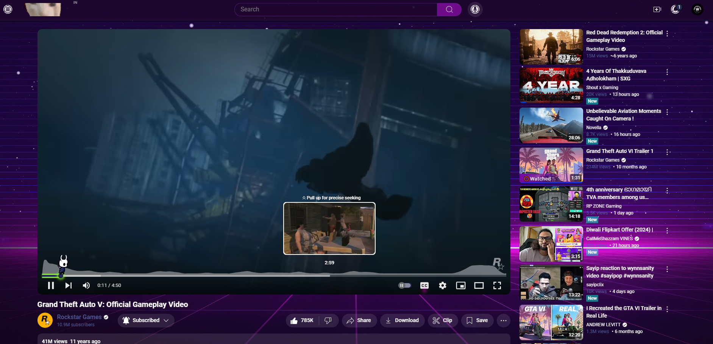

# Custom YouTube Theme for Stylish Extension

This is a custom theme for YouTube, designed to completely transform the YouTube interface into a neon retro aesthetic. It includes custom elements such as a neon-themed YT logo, a dynamic timeline, and retro-style visual accents throughout the page. Additionally, it features a live retro wallpaper as the background, making your YouTube browsing experience both visually striking and unique.

## Key Features

### 1. **Custom YouTube Logo**
   - The standard YouTube logo is replaced with a custom neon retro version to align with the theme's overall aesthetic.
   - The neon glow around the logo adds to the theme’s vibrant and lively retro look.

### 2. **Custom Timeline**
   - The playback timeline has been enhanced with neon colors and a smooth gradient effect to stand out.
   - As you scroll through videos or live streams, the glowing timeline bar provides a sleek, futuristic feel.

### 3. **Neon Retro Visuals**
   - Every element on the page, from the video player to the buttons and text, is enveloped in a glowing neon retro style.
   - Borders, buttons, and hover effects have been meticulously styled to deliver an immersive neon-lit experience.

### 4. **Live Retro Wallpaper Background**
   - The entire background of YouTube is transformed with a live retro-themed wallpaper, creating an animated backdrop that complements the vibrant, retro theme.
   - The wallpaper is subtle enough to avoid distractions but adds a layer of depth to the overall theme.

## Screenshots

| Feature          | Screenshot                                                                  |
|------------------|-----------------------------------------------------------------------------|
| Custom Logo      |                                      |
| Custom Timeline  |                                 |
| Full Page Theme  |                           |
| Live Wallpaper   |                                 |

## Installation

1. Install the [Stylish](https://userstyles.org/) browser extension if you haven't already.
   - [Chrome Extension](https://chrome.google.com/webstore/detail/stylish-custom-themes-for/fjnbnpbmkenffdnngjfgmeleoegfcffe)
   - [Firefox Add-on](https://addons.mozilla.org/en-US/firefox/addon/stylish/)
2. Open Stylish and click on the "Create New Style" button.
3. Paste the custom CSS provided in this repository into the code editor.
4. Save and enable the style to apply it to YouTube.

## How to Use

- After installation, the theme will automatically apply whenever you visit YouTube.
- The theme is designed to be compatible with all video player modes (normal, theater, and full screen).
- You can toggle the theme on and off from the Stylish extension icon.

## Customization

This theme can be further customized to your liking. Here are a few tips:

1. **Change the Live Wallpaper:**
   - You can easily swap out the live wallpaper with your own by editing the CSS background URL.

   ```css
   body {
     background: url('link-to-your-preferred-wallpaper') no-repeat center center fixed;
     background-size: cover;
   }
